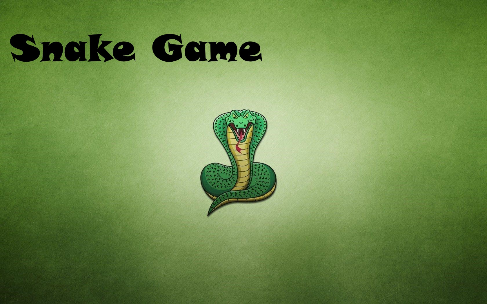

<div align="center">

# SNAKE GAME

### Two players. One keyboard. Three ways to play.

A local multiplayer Snake game built with Python and Pygame for the **Python for Engineers** course at Shenkar College.

[Explore the project page](https://adig741.github.io/snake-game/) · [Watch the gameplay video](https://www.youtube.com/watch?v=8dPCcWmFBHo) · [Run the game](#run-locally)



</div>

## At a glance

| | |
| --- | --- |
| **Players** | Two people sharing one keyboard |
| **Modes** | Easy, Medium, Hard |
| **Built with** | Python, Pygame |
| **Platform** | Desktop |
| **Course** | Python for Engineers, Shenkar College |

Guide two snakes around the board, collect apples, and see who can grow longer. Each player has independent controls and a live score. The menu lets you choose a difficulty, toggle audio, restart after a round, or return to level selection.

## Game modes

| Mode | What appears on the board |
| --- | --- |
| **Easy** | Regular apples |
| **Medium** | Regular apples and poison apples |
| **Hard** | Regular, poison, and golden apples |

Regular and golden apples grow your snake by one segment. Poison apples and boundary collisions end the round.

## Controls

| Action | Player 1 | Player 2 |
| --- | --- | --- |
| Move up / down / left / right | Arrow keys | W / S / A / D |
| Restart after game over | Enter | Enter |
| Return to level selection | Esc | Esc |

Use the mouse to navigate the main menu and choose a difficulty.

## Run locally

Install Python 3 and run these commands from the repository root:

```bash
python -m pip install -r requirements.txt
cd game
python main.py
```

On Windows, use `py` instead of `python` if that is how Python is installed. Run the program from the `game` folder so it can find its images and sounds.

## Project structure

```text
snake-game/
├── game/             # Pygame source and bundled game assets
│   ├── main.py
│   ├── button.py
│   ├── images/
│   ├── resources/
│   └── sounds/
├── docs/             # GitHub Pages project showcase
├── requirements.txt
└── README.md
```

The [project page](https://adig741.github.io/snake-game/) presents the game and its features. The desktop game runs locally with Pygame; the page is its showcase.

## About this repository

This is a publication-ready copy of the course project. It includes the game source and the assets needed to run it, while leaving out virtual environments, duplicate drafts, large archives, and student identification numbers from the original working folder.

**Course:** Python for Engineers, Shenkar College of Engineering, Design and Art
